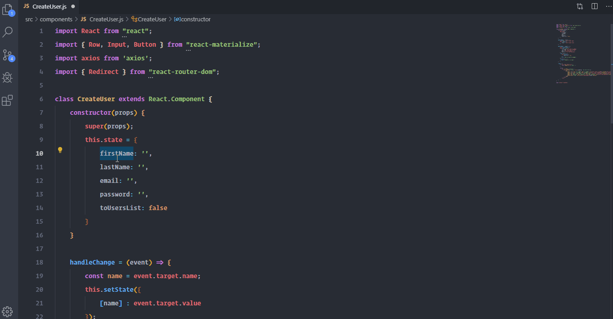

# vscode-case-shifter

VsCode Case Shifter allows you to easily convert text between snake_case, camelCase, StudlyCaps and more.

## Demo



## Commands

Search these commands by the title on command palette.

```javascript
[
    {
        "command": "vscode-case-shifter.kebabCase",
        "title": "Convert to kebab-case"
    },
    {
        "command": "vscode-case-shifter.camelCase",
        "title": "Convert to camelCase"
    },
    {
        "command": "vscode-case-shifter.studlyCase",
        "title": "Convert to StudlyCase"
    },
    {
        "command": "vscode-case-shifter.snakeCase",
        "title": "Convert to snake_case"
    }
]
```

## Keybindings

You can override these default keybindings on your `keybindings.json`.
```javascript
[
    {
        "command": "vscode-case-shifter.kebabCase",
        "key": "ctrl+shift+k",
        "when": "editorHasSelection"
    },
    {
        "command": "vscode-case-shifter.camelCase",
        "key": "ctrl+shift+c",
        "when": "editorHasSelection"
    },
    {
        "command": "vscode-case-shifter.studlyCase",
        "key": "ctrl+shift+s",
        "when": "editorHasSelection"
    },
    {
        "command": "vscode-case-shifter.snakeCase",
        "key": "ctrl+shift+n",
        "when": "editorHasSelection"
    }
]
```
